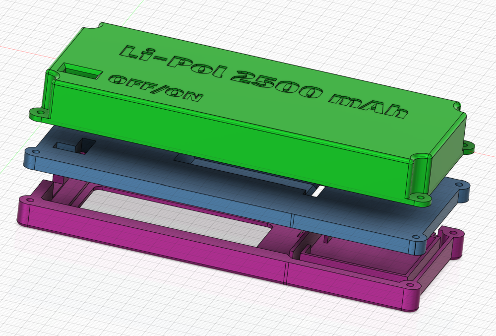
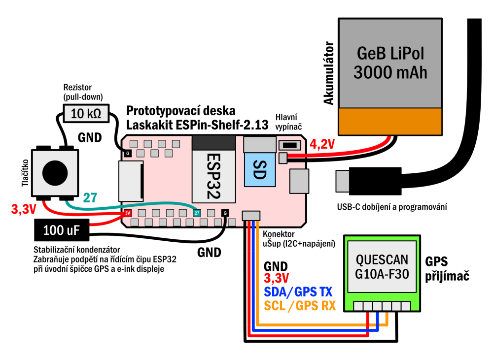
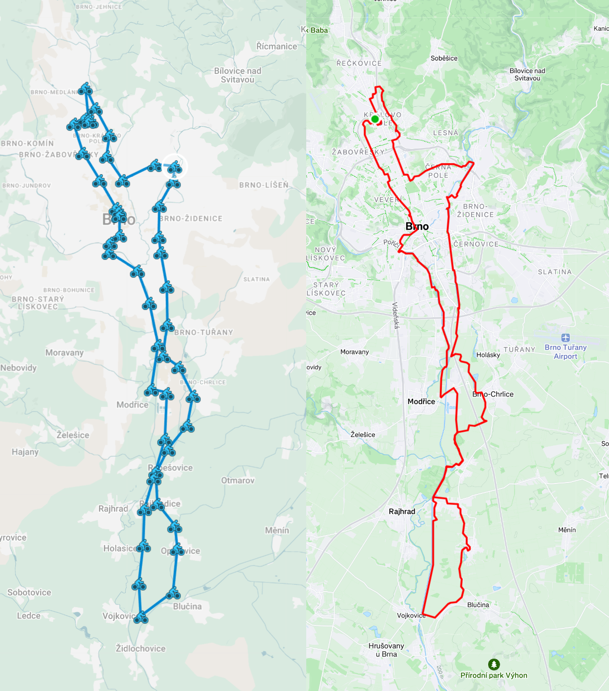

# GPS Tracker na dovolenou

**Příloha projektu GPS trackeru s dlouhou výdrží** na letní expedici, které se věnuji i v článku v časopisu [Computer 07/2025](https://www.ikiosek.cz/computer).

**Pozor, tato stručná dokumentace na GitHubu není náhradou článku, ale pouze jeho doplněním!** Podpořte kutilskou žurnalistiku a kupte si časopis Computer, který je k dispozici i v elektronické podobě :-).

]

---

## Zdrojové kódy

Zdrojový kód pro prototypovací desku [ESPInk-Shelf](https://www.laskakit.cz/en/laskakit-espink-shelf-213-esp32-e-paper/) najdete v adresáři `Arduino`. Kód je připraven pro [Platformio IDE](https://platformio.org/platformio-ide). Adresář obsahuje i konfigurační soubor `platformio.ini`.

V adresáří `SD karta` najdete ukázkový obsah na microSD zasunuté do prototypovací desky. Soubor `zaznam.txt` obsahuje ukázku zaznamenaných dat ve formátu CSV, klíčový je ale především soubor `config.json` s konfigurací programu. Pokud bude soubor chybět, použije se výchozí konfigurace, která je součástí firmwaru.

Konfigurace se načítá jen při studeném startu (třeba vypnutí a zapnutí pomcoí tlačítka na desce, odpojení napájení atp.), jinak se totiž udržuje v `RTC RAM` čipu ESP32, tedy paměti, která se udržují i po resetu z hlubokého spánku. 

Při překladu v Arduino IDE si musíte ručně stáhnout tyto knihovny:

- [TinyGPS++](https://github.com/mikalhart/TinyGPSPlus)
- [ArduinoJson](https://arduinojson.org/)
- [GxEPD2](https://github.com/ZinggJM/GxEPD2)
- [AdafruitGFX](https://github.com/adafruit/Adafruit-GFX-Library)

---

## Krabička

V adresáří `3D tisk` najdete soubory krabičky ve formátu STEP (na rozdíl od STL zachovává oblé tvary s vysokou přesností). Skládá se z krytu dsipleje, oddělovací střední přepážky a boxu pro [2500mAh baterii GeB](https://www.laskakit.cz/en/baterie-li-po-3-7v-2000mah-lipo/). Při volbě jiného akumulátoru tak stačí vytisknout jiný bateriový kryt a není třeba předělávat celý design krabičky. Krabičku drží pohromadě čtyři dlouhé šroubky M2 (délka alespoň 15 mm). Podívejte se na další obrázky montáže v adresáři `prilohy`.

]

---

## Zapojení

K desce ESPInk-Shelf stačí skrze konektor **uŠup** připojit libovolný GPS přijímač s rozhraním **UART** a napájením **3,3V**. Viz schéma zapojení níže:

[](prilohy/schema.png)

Vedle základní desky ESPInk-Shelf jsem použil čínský GPS modul [Quescan G10A-F30](https://www.aliexpress.com/item/1005005621100756.html) s integrovanou anténou. Vedle GPS podporuje i další systémy, polohu přijímá i v naší střešní kanceláři a první fix v průměru získal v řádu jednotek sekund. Můžete ale použít jakýkoliv modul, který komunikuje skrze UART a textové zprávy NMEA 0183, kterým rozumí kniohnva TinyGPS++. Součástí obvodu je ještě tlačítko a kondenzátor. Viz níže.

---

## Stabilita napájení

Deska v jeden okamžik spíná napájení GPS přijímače i e-ink displeje. Pokud GPS přijímač začne dobíjet svou vnitřní baterii, může to vést k poklesu napětí a brownoutu (reset ESP32). Řešením je přidat mezi **3,3V** a **GND** kondenzátor **100 µF** – tím se zajistí stabilita i při delším provozu.

---
## Způsob měření a praktické zkušenosti

Ve výchozím stavu deska měří polohu každých 10 minut (viz konfigurace config.json) a po zbytek času se přepíná do hlubokého spánku. Během této doby je odpojeno i napájení GPS přijímače, každý nové hledání polohy proto může zabrat 0,5-30 sekund podle toho, jestl ise stačila dobít udržovací baterie GPS modulu. Díky nižší frekvenci zjišťování polohy může GPS tracker s vhodnou baterií (2500 mAh a více) vydržet i několik dlouhých týdnů. GPS tracker zároveň ukládá polohu jen tehdy, pokud se dvě po sobě jdoucí polohy liší o určitou vzdálenost (parametr `minimum_change_to_log_meters` v config.json). Zároveň se neukládá hned první validní fix, ale čekáme na několik poloh s předpokladem, že se bude postupně zpřesňovat (parametr required_fixes v `config.ini`). Je třeba zároveň nastavit správnou rychlost sériového spojení s GPS přijímačem (parametr `serial_nema_baudrate`).

Pokud bude vše fungovat, až několikatýdenný GPS tracker může zaznamenat trasu třeba jako na obrázku níže. Vlevo GPS tracker, vpravo běžný záznam aktivity ve sportovní aplikaci Strava.


---

## Tlačítko a režim UART

Na desce je připojeno **tlačítko**, které slouží k:

- rychlému probuzení a změření polohy (krátký stisk)
- přechodu do **UART režimu** pro přístup k SD kartě přes USB (dlouhý stisk)

V **UART režimu** (rychlost **115200 b/s**) zařízení poslouchá na primární USB sériové lince a čeká na příkazy:

- `ls` (ukončeno znakem `\n`) – vypíše seznam souborů na SD kartě  
- `cat NAZEVSOUBORU\n` – vypíše obsah daného souboru (předpokládá se, že jde o text)  
- `rm NAZEVSOUBORU\n` – smaže daný soubor

Zařízení odpovídá ve formátu:

```
response;cmd:PRIKAZ;DATA
```

### Příklady odpovědí:

- Na příkaz `ls` odpoví např.:
  ```
  response;cmd:ls;data:soubor1,soubor2,soubor3...
  ```

- Na příkaz `cat soubor1.txt` odpoví např.:
  ```
  response;cmd:cat;filename:soubor1.txt;size:5;data:
  ahoj
  ```

Čekání na sériová data je možné kdykoliv ukončit:

- krátkým stiskem tlačítka,
- nebo automaticky po určité době neaktivity (kdy nepřichází žádná sériová data).

Po startu zařízení navíc čeká, dokud uživatel neuvolní tlačítko. To je důležité, aby se detekoval skutečný nový stisk – jinak by zařízení mohlo chybně interpretovat trvající stisk jako pokyn k ukončení UART režimu.
