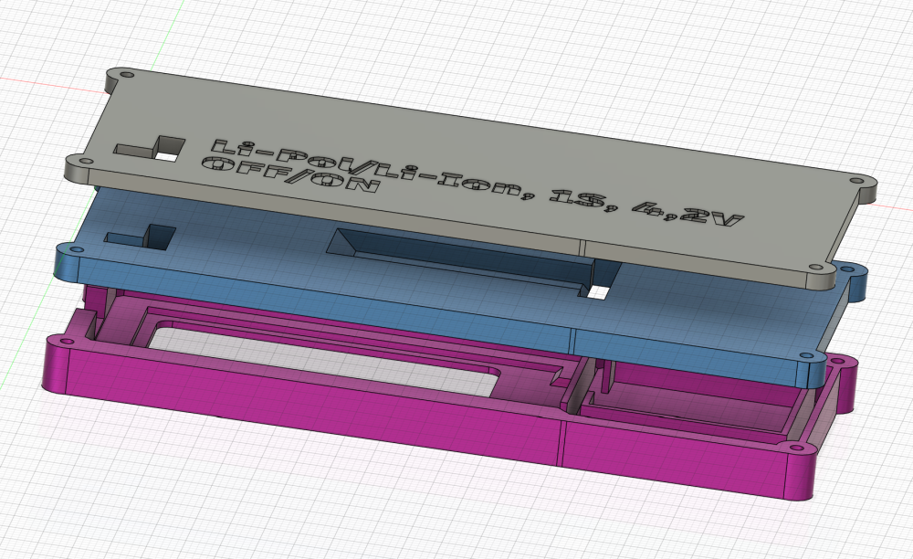
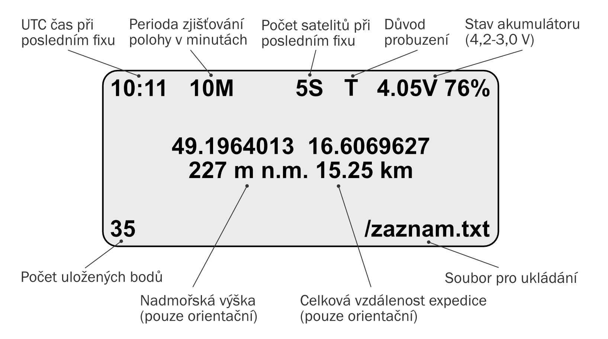
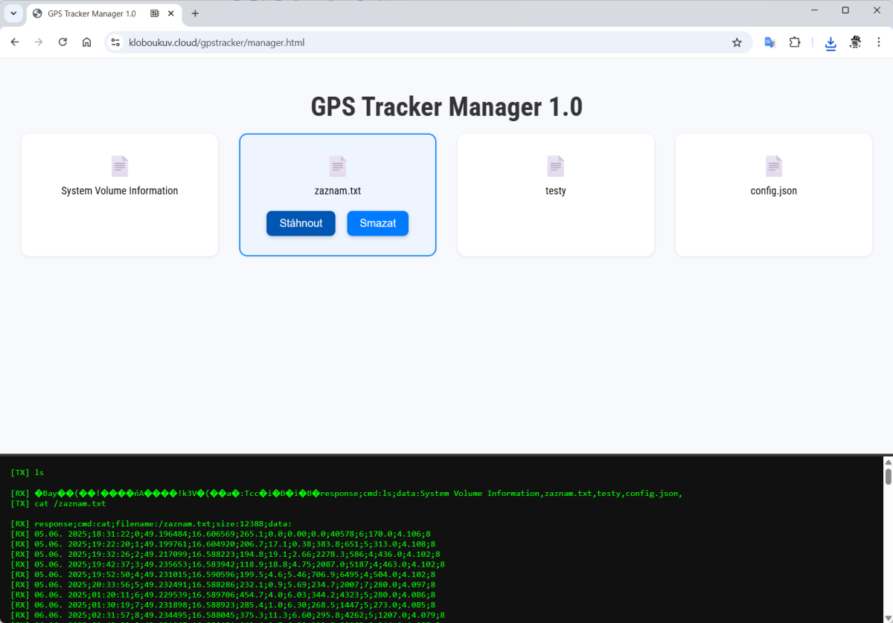

# GPS Tracker na dovolenou

**Příloha projektu „GPS tracker s dlouhou výdrží na letní expedici“**, kterému se věnuji v časopisu [Computer 07/2025](https://www.ikiosek.cz/computer).

**Pozor, tato stručná dokumentace na GitHubu není náhradou článku, ale pouze jeho doplněním!** Podpořte kutilskou žurnalistiku a kupte si časopis Computer, který je k dispozici i v elektronické podobě :-).

]

---

## BoM (Bill of Materials / seznam použitých součástek)
- Prototypovací deska [LaskaKit ESPInk-Shelf-2.13](https://www.laskakit.cz/laskakit-espink-shelf-213-esp32-e-paper/)
- Akumulátor [GeB LiPol Battery 104050 2500mAh 3.7V JST-PH 2.0](https://www.laskakit.cz/baterie-li-po-3-7v-2000mah-lipo/)
- Redukce napájecího kabelu s malým konektorem pro desky ESPInk-Shelf [JST-PH-2 2mm to JST-SH-2 1mm battery adapter, 5cm](https://www.laskakit.cz/jst-ph-2-2mm-do-jst-sh-2-1mm-adapter-pro-baterie/)
- GPS přijímač [Quescan G10A-F30](https://www.aliexpress.com/item/1005005621100756.html) (aktuálně testuji spolehlivější [modul od Wavesharu s čipem Quectel LC76G](https://www.waveshare.com/lc76g-gnss-module.htm))
- [Tlačítko 6×6×8 mm](https://www.laskakit.cz/tlacitko-6x6x8mm/)
- [100uF kondenzátor](https://www.laskakit.cz/aishi-ers1vm101e12ot-100uf-20--35v-kondenzator-elektrolyticky/)
- [10kOhm rezisotr pro tlačítko](https://www.laskakit.cz/futaba-1-4w-odpor-10k-5/)
- propojovací drátky

Tlačítko a kondenzátor vyžadují pájení! Všechny ostatní komponenty jsou zacvakávací. Tlačítko ale není pro základní funkci nutné (jen pro ruční ukládání poloh a kopírování dat z SD skrze USB). Aktuální verze firmwaru zároveň snižuje výkon procesoru na 40 MHz, čímž se snižuje proud a kondenzátor by možná nebyl potřeba (viz sekce Zapojení). Netestováno!

---

## Zdrojové kódy

Zdrojový kód pro prototypovací desku [ESPInk-Shelf](https://www.laskakit.cz/en/laskakit-espink-shelf-213-esp32-e-paper/) najdete v adresáři `Arduino`. Kód je připraven pro [Platformio IDE](https://platformio.org/platformio-ide). Adresář obsahuje i konfigurační soubor `platformio.ini`.

V adresáři `SD karta` najdete ukázkový obsah na microSD zasunuté do prototypovací desky. Soubor `zaznam.txt` obsahuje ukázku zaznamenaných dat ve formátu CSV (pořadí položek viz dokumentace ve zdrojovém kódu main.cpp), klíčový je ale především soubor `config.json` s konfigurací programu. Pokud bude soubor chybět, použije se výchozí konfigurace, která je součástí firmwaru.

Konfigurace se načítá jen při studeném startu (třeba vypnutí a zapnutí pomocí tlačítka na desce, odpojení napájení atp.), jinak se totiž udržuje v `RTC RAM` čipu ESP32, tedy paměti, která se udržují i po resetu z hlubokého spánku. 

Při překladu v Arduino IDE si musíte ručně stáhnout tyto knihovny:

- [TinyGPS++](https://github.com/mikalhart/TinyGPSPlus)
- [ArduinoJson](https://arduinojson.org/)
- [GxEPD2](https://github.com/ZinggJM/GxEPD2)
- [AdafruitGFX](https://github.com/adafruit/Adafruit-GFX-Library)

---

## Krabička

V adresáři `3D tisk` najdete soubory krabičky ve formátu `STEP` (na rozdíl od STL zachovává oblé tvary s vysokou přesností; podporuje jej PrusaSlicer a další). Krabičku libovolně modifikujte dle chuti. Skládá se z krytu displeje, oddělovací střední přepážky a boxu pro [2500mAh baterii GeB](https://www.laskakit.cz/en/baterie-li-po-3-7v-2000mah-lipo/). Při volbě jiného akumulátoru tak stačí vytisknout jiný bateriový kryt a není třeba předělávat celý design krabičky. Krabičku drží pohromadě čtyři dlouhé šroubky M2 (délka alespoň 15 mm). Podívejte se na další obrázky montáže v adresáři `prilohy`.


Namísto krytu s baterií lze použít i kryt bez baterie, pokud budeme GPS tracker napájet externím akumulátorem mimo box, anebo z USB-C. V takovém případě je ale třeba použít USB-C zdroj, který se při nízkém odběru nevypíná. Pozor, většina powerbank se vypíná! V době nečinnosti obvod spaluje jen jednotky až nízké desítky uA elektrického proudu a powerbanka odpojí napájení. V takovém případě se ale procesor už nikdy neprobudí ze spánku! Při napájení skrze USB-C je proto třeba použít zdroj, který je za všech okolností stále aktivní. V případě USB v automobilu si to raději dopředu ověřte (zvláště u elektroautomobilů, které mohou šetřit energii). 



---

## Zapojení

K desce ESPInk-Shelf stačí skrze konektor **uŠup** připojit libovolný GPS přijímač s rozhraním **UART** a napájením **3,3V**. Viz schéma zapojení níže:

[](prilohy/schema.png)

Vedle základní desky ESPInk-Shelf jsem použil čínský GPS modul [Quescan G10A-F30](https://www.aliexpress.com/item/1005005621100756.html) s integrovanou anténou. Vedle GPS podporuje i další systémy, polohu přijímá i v naší střešní kanceláři a první fix v průměru získal v řádu jednotek sekund. Můžete ale použít jakýkoliv modul, který komunikuje skrze UART a textové zprávy NMEA 0183, kterým rozumí knihovna TinyGPS++. Součástí obvodu je ještě tlačítko a kondenzátor. Viz níže.

---

## Stabilita napájení

Deska v jeden okamžik spíná napájení GPS přijímače i e-ink displeje. Pokud GPS přijímač začne dobíjet svou vnitřní baterii, může to vést k poklesu napětí a brownoutu (reset ESP32). Řešením je přidat mezi **3,3V** a **GND** kondenzátor **100 µF** – tím se zajistí stabilita i při delším provozu.

---
## Způsob měření a praktické zkušenosti

Ve výchozím stavu deska měří polohu každých 10 minut (viz konfigurace config.json) a po zbytek času se přepíná do hlubokého spánku. Během této doby je odpojeno i napájení GPS přijímače, každé nové hledání polohy proto může zabrat 0,5-30 sekund podle toho, jestli se stačila dobít udržovací baterie GPS modulu.



Díky nižší frekvenci zjišťování polohy může GPS tracker s vhodnou baterií (2500 mAh a více) vydržet i několik dlouhých týdnů. GPS tracker zároveň ukládá polohu jen tehdy, pokud se dvě po sobě jdoucí polohy liší o určitou vzdálenost (parametr `minimum_change_to_log_meters` v config.json). Zároveň se neukládá hned první validní fix, ale čekáme na několik poloh s předpokladem, že se bude postupně zpřesňovat (parametr `required_fixes`). Je třeba zároveň nastavit správnou rychlost sériového spojení s GPS přijímačem (parametr `serial_nema_baudrate`).

Pokud bude vše fungovat, až několikatýdenní GPS tracker může zaznamenat trasu třeba jako na obrázku níže. Vlevo GPS tracker, vpravo běžný záznam aktivity ve sportovní aplikaci Strava.


---

## Tlačítko a režim UART

Na desce je připojeno **tlačítko**, které slouží k:

- rychlému probuzení a změření polohy (krátký stisk)
- přechodu do **UART režimu** pro přístup k SD kartě přes USB (dlouhý stisk)

V **UART režimu** (rychlost **115200 b/s**) zařízení poslouchá na primární USB sériové lince a čeká na příkazy:

- `ls` (ukončeno znakem `\n`) – vypíše seznam souborů na SD kartě  
- `cat NAZEVSOUBORU\n` – vypíše obsah daného souboru (předpokládá se, že jde o text)  
- `rm NAZEVSOUBORU\n` – smaže daný soubor
- `store NAZEVSOUBORU POCETBAJTU\n64B←SR\n64B←SR\n...` – uloží soubor na SD kartu po 64B blocích s ACK. Po odeslání každého bloku čekáme na SR\n potvrzení (Store Ready), že zařízení zpracovalo dávku a je připraveno na dálší blok

Zařízení odpovídá ve formátu:

```
response;cmd:PRIKAZ;DATA
```

### Příklady odpovědí:

- Na příkaz `ls` odpoví např.:
  ```
  response;cmd:ls;data:soubor1,soubor2,soubor3...
  ```

- Na příkaz `cat soubor1.txt` odpoví např.:
  ```
  response;cmd:cat;filename:soubor1.txt;size:5;data:
  ahoj
  ```

- Na příkaz `store config.json 154\n(prvních 64 B)` odpoví:
  ```
  SR
  ```

Čekání na sériová data je možné kdykoliv ukončit:

- krátkým stiskem tlačítka,
- nebo automaticky po určité době neaktivity (kdy nepřichází žádná sériová data).

Po startu zařízení navíc čeká, dokud uživatel neuvolní tlačítko. To je důležité, aby se detekoval skutečný nový stisk – jinak by zařízení mohlo chybně interpretovat trvající stisk jako pokyn k ukončení UART režimu.

---

### HTML GUI

V adresáři `HTML` najdete jednoduchý prototyp webové stránky manager.html, která pomocí technologie WebSerial API a povelů výše dokáže zobrazit a stáhnout soubory na SD kartě po připojení zařízení k počítači. Manager.html musí běžet na HTTPS serveru, jinak webový prohlížeč odmítne připojení k USB. Technologii WebSerial podporují jen některé webové prohlížeče a ne na všech operačních systémech. Testováno v Chromu na Windows. Manager je dostupný i online na adrese [kloboukuv.cloud/gpstracker/manager.html](https://kloboukuv.cloud/gpstracker/manager.html).



