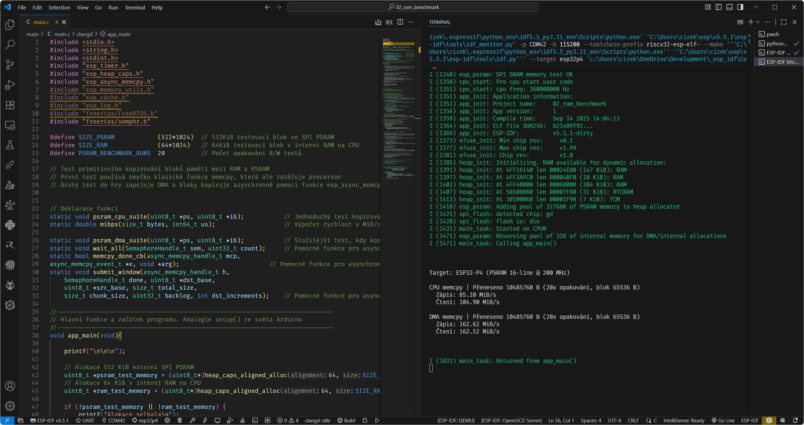

# Druhý program na ESP32-P4

**Příloha článku „Stíhačka z Asie ESP32-P4“**, kterému se věnuji v časopisu [Computer 10/2025](https://www.ikiosek.cz/computer).

Program provede primitivní benchmark zápisu a čtení z externí PSRAM. Nejprve pomocí běžného memcpy po malých blocích paměti a podruhé pomocí asynchronního memcpy skrze DMA.

- Použitý hardware: [Waveshare ESP32-P4-WIFI6](https://www.waveshare.com/esp32-p4-wifi6.htm?sku=32020) (zmenšenína oficiálního devkitu od Espressifu)
- Vývojové prostředí: [ESP-IDF](https://docs.espressif.com/projects/esp-idf/en/stable/esp32p4/get-started/index.html)

Výstup do konzole sériové linky by mohl vypadat třeba takto (Visual Studio Code s pluginem ESP-IDF. Víz odkaz výše):

]
