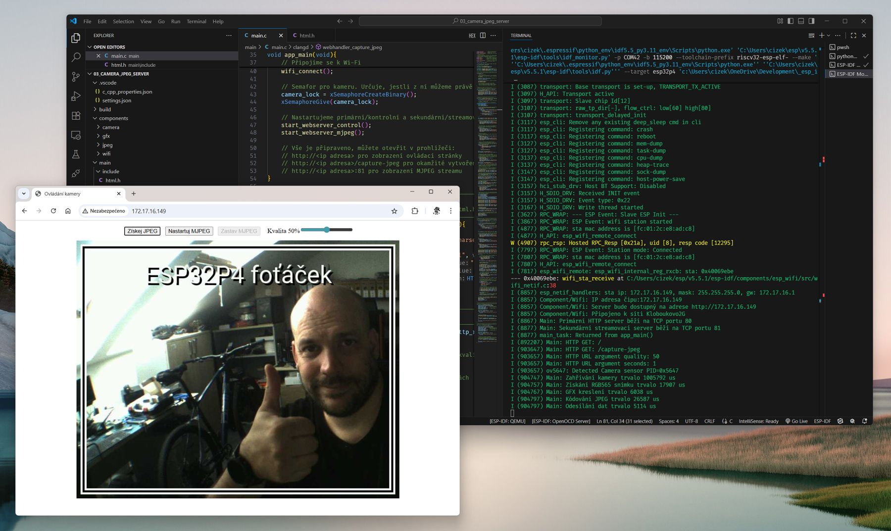

# Třetí program na ESP32-P4

**Příloha článku „Stíhačka z Asie ESP32-P4“**, kterému se věnuji v časopisu [Computer 10/2025](https://www.ikiosek.cz/computer).

Program spustí dva jednoduché HTTP servery. Na portu 80 běží webový ovládací server a na portu 81 streamovací MJPEG server. Základní webový server zobrazí ovládací HTML stránku s možností pořízení JPEG snímku a spuštění MJPEG streamu. Pozor, na Wi-Fi zatím realtivně pomalé. Je třeba dále ladit. 
Wi-fi SSID a heslo nastavte v menuchonfig, nebo v souboru sdkconig.defaults (CONFIG_WIFI_SSID a CONFIG_WIFI_PASSWORD). Případně natvrdo v kódu v hlavičkovém souboru components/wifi/include/wifi.h.

- Použitý hardware: [Waveshare ESP32-P4-WIFI](https://www.waveshare.com/esp32-p4-wifi6.htm?sku=32020) (zmenšenína oficiálního devkitu od Espressifu)
- Použitá kamera: [Libovolný klon RPi kamery se snímačem OV5647 a rozhraním MIPI CSI](https://www.waveshare.com/rpi-camera-b.htm)
- Propojovací kabel kamery s užší/Mini koncovkou pro konektor desky: [Raspberry Pi Camera Cable Standard - Mini 200 mm](https://rpishop.cz/mipi/6501-raspberry-pi-5-camera-cable-standard-mini-200-mm.html)
- Vývojové prostředí: [ESP-IDF](https://docs.espressif.com/projects/esp-idf/en/stable/esp32p4/get-started/index.html)

Výstup do konzole sériové linky by mohl vypadat třeba takto (Visual Studio Code s pluginem ESP-IDF. Víz odkaz výše):

]
